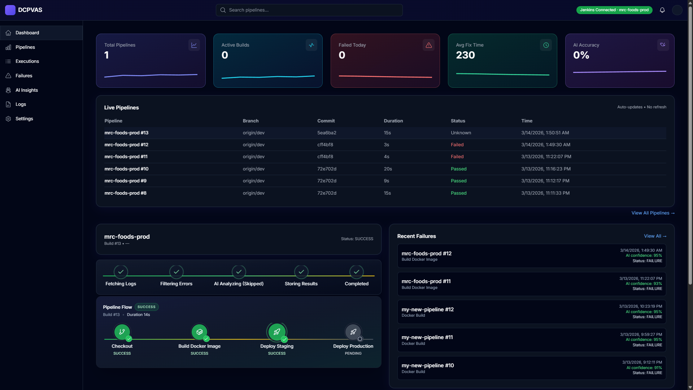

# DevOps CI/CD Pipeline Visualizer (DCPVAS)

     

DCPVAS is a MERN application that visualizes Jenkins CI/CD pipelines in real time and delivers evidence-based failure analysis from actual Jenkins console logs. All analysis is computed in the backend using OpenAI Responses API (model: gpt-5-mini). No mock data is used.

## License and Usage

- Proprietary and not open-source. All Rights Reserved.
- Copyright © 2026 <Author Name>.
- No permission is granted to use, modify, distribute, or create derivative works from this codebase without prior written permission from the author.
- Third-party dependencies are licensed by their respective authors; refer to their repositories for terms.
- Project ownership: created and owned by the author as a private, personal academic and research project.
- Shared solely for viewing and evaluation purposes; cloning, copying, redistributing, or using for coursework, academic submission, or commercial activities is not permitted without prior written permission.
- Research notice: any reuse for research, publication, or coursework requires prior written permission; cite ideas appropriately and do not copy source code.
- Provided "as-is" without warranties; the author assumes no liability for misuse or derivative works.

## Current Scope

- Live Jenkins monitoring via backend polling (read-only; frontend never calls Jenkins directly).
- AI-assisted failure analysis per build with humanSummary, suggestedFix, technicalRecommendation, failedStage, detectedError, confidenceScore.
- Socket-driven real-time updates for analysis progress, completion, build starts, and live log streaming.
- Dynamic Jenkins configuration saved in MongoDB with encrypted API token; validated via backend before enabling views.
- Dashboards: Dashboard, Pipelines, Execution History, AI Insights, Settings.
- Landing site with dark SaaS theme and lightweight 3D hero background.

## Architecture

- Jenkins → Backend (Express, Socket.IO) → MongoDB → Frontend (React, Vite, Tailwind, Recharts).
- Backend polls Jenkins Remote API (read-only) and wfapi/consoleText for stages and logs; stages fall back to log parsing.
- AI analysis uses OpenAI Responses API (gpt-5-mini) with strict JSON schema; results stored in MongoDB.
- Socket.IO for live events; REST for initial fetches. SSE stream available for pipeline stages.
- Landing app is a separate Vite/Tailwind site (dark SaaS theme) with [landing/src/components/HeroBackground3D.jsx](landing/src/components/HeroBackground3D.jsx).

## Feature Highlights

- Pipeline visualization: Interactive depiction of stages (Checkout, Build, Unit Test, Docker Build, Deploy) with live status via `/api/pipeline/latest-flow` and SSE `/api/pipeline/stream` (PipelineFlow component uses latest-flow).
- Real-time build monitoring: Backend polls Jenkins, emits `build:new`, `build:started`, `build:log_update`, and updates cached runs.
- AI Insights dashboard: Pipeline Stability Score, Most Failing Stage, Failure Trend (Last 7 Days), Stage Reliability, AI Suggested Fixes, AI Summary cards; Recent Failures panel with confidence indicators.
- Failure Intelligence timeline: Aggregated failures with failedStage and detectedError from historical builds.
- Log handling: Jenkins consoleText fetched server-side, sanitized (ANSI/control removal), decoded, and analyzed; placeholder messaging for pre-execution failures.
- Settings-driven Jenkins integration: Save & Connect flow stores Jenkins URL, job name, username, encrypted API token; verify endpoint confirms connectivity.
- Security posture: Credentials only in backend/MongoDB (encrypted); frontend never sees tokens.
- Landing experience: Tailwind v4 tokens defined in [landing/src/index.css](landing/src/index.css) with dark palette; 3D background driven by @react-three/fiber and @react-three/drei; scroll-based, one-way animation.

## Data Flow (Live Mode)

1. Jenkins runs pipelines (app never triggers builds).
2. Backend `jenkinsService` loads Jenkins config from MongoDB (encrypted token), polls Remote API, and caches latest build/logs/stages.
3. New builds emit `build:new`; log streaming emits incremental `build:log_update` chunks.
4. Logs are sanitized; AI analysis runs in backend using OpenAI Responses API; progress is emitted via Socket.IO and persisted.
5. Frontend uses REST for initial data and Socket.IO for progress/completion to render final analysis without manual refresh.

## Backend API Surface

- Pipeline
  - GET `/api/pipeline/latest` — Latest build + AI analysis (stage recovery fallback).
  - GET `/api/pipeline/latest-flow` — Normalized stage flow for PipelineFlow UI.
  - GET `/api/pipeline/stream` — SSE stream of stage flow (3s poll) until completion.
  - GET `/api/pipeline/history?limit=all|N` — Recent builds with AI summaries.
  - GET `/api/pipeline/logs/:number` — Raw console logs (sanitized placeholder for pre-exec failures).
  - GET `/api/pipeline/stages` — Latest stages with recovery.
  - GET `/api/pipeline/build/:number` — Build with AI details.
  - GET `/api/pipeline/analysis/:number` — Latest persisted AI document.
  - GET `/api/pipeline/diagnostics` — Jenkins env flags, liveEnabled.
  - GET `/api/pipeline/failures` — Failure Intelligence timeline.
  - POST `/api/pipeline/ai/analyze` — Analyze pasted logs (emits progress/complete events).
  - POST `/api/pipeline/reanalyze/:number` — Re-run AI analysis for a build.
- Executions
  - GET `/api/executions` — List executions (job, buildNumber, status, failedStage, executedAt).
  - GET `/api/executions/:id` — Execution by id.
- Dashboard
  - GET `/api/dashboard/metrics` — Summary metrics (controller-backed).
- Settings (Jenkins)
  - POST `/api/settings/jenkins` — Save `{ jenkinsUrl, jobName, username, apiToken }` (token encrypted).
  - GET `/api/settings/jenkins` — Fetch saved settings (token omitted).
  - POST `/api/settings/jenkins/test` — Verify connectivity and mark isConnected/lastVerifiedAt.
- OpenAI health/tests
  - GET `/api/health/openai` — `{ openaiKeyLoaded, model }`.
  - GET `/api/test/openai-text` — Text response sanity check.
  - GET `/api/test/openai-json` — Structured JSON test (Responses API with json_object).
  - POST `/api/test/analyze-log` — Analyze provided Jenkins log (strict JSON schema).

## Real-Time Events (Socket.IO)

- `analysis:progress` — `{ buildNumber, status, stage, message }`; stages: FETCHING_LOGS → FILTERING_ERRORS → AI_ANALYZING → STORING_RESULTS → COMPLETED.
- `analysis:complete` and `analysis:completed` — `{ buildNumber, status: 'COMPLETED', humanSummary, suggestedFix, technicalRecommendation, confidenceScore }`.
- `analysis:skipped` — Emitted when build is SUCCESS.
- `build:new` — `{ jobName, buildNumber, status|buildStatus }` on increment.
- `build:started` — `{ buildNumber }` when a new run begins.
- `build:log_update` — `{ buildNumber, newLogsChunk }` streaming live console text.
- `logs:watch` socket message triggers backend log watcher for a build.
- SSE: `/api/pipeline/stream` sends stage flow updates every 3s until completion.

## AI Analysis Pipeline

- Model: gpt-5-mini via OpenAI Responses API.
- Schema-enforced JSON output: failedStage, detectedError, humanSummary (overview, failureCause[], pipelineImpact[]), suggestedFix (immediateActions[], debuggingSteps[], verification[]), technicalRecommendation (codeLevelActions[], pipelineImprovements[], preventionStrategies[]), confidenceScore.
- Steps persisted on PipelineAIAnalysis: FETCHING_LOGS → FILTERING_ERRORS → AI_ANALYZING → STORING_RESULTS → COMPLETED.
- Analyses are skipped for successful builds to conserve quota; audit records prevent re-triggering.

## Jenkins Settings and Security

- Settings stored in MongoDB collection `jenkins_settings`; API token encrypted via `SECRET_KEY` (cryptoService).
- Backend decrypts token at runtime; frontend never receives credentials.
- Connectivity test hits Jenkins root and job endpoints; marks `isConnected` and `lastVerifiedAt`.
- `isLiveEnabled()` still checks env vars for diagnostics compatibility.

## Jenkins Test Pipeline (Validation)

- Scripted pipeline in Jenkins (Checkout, Build, Unit Test, Docker Build, Deploy).
- Unit Test stage intentionally fails with AssertionError; downstream stages skip to mimic production behavior.
- Logs ingested and analyzed to produce structured AI insights.

## Frontend (App)

- Stack: React 18, Vite, TailwindCSS, Recharts, React Query, Socket.IO client, Framer Motion, Heroicons, Lucide.
- Pages: Dashboard, Pipelines, Execution History, AI Insights, Settings.
- Components include PipelineFlow (uses `/api/pipeline/latest-flow`), AI insights cards, recent failures list, log/analysis viewers, Navbar with Jenkins connection badge.
- State/query: React Query for data fetching; sockets for progress/completion and log streaming.
- UI theme: modern dark, responsive, inspired by GitHub/Vercel/Datadog.

## Landing App (Dark SaaS Theme)

- Tailwind v4 configured with `@tailwindcss/vite`; design tokens declared in [landing/src/index.css](landing/src/index.css) via `@theme` (bg, surface, primary #7C5CFF, accent #00E5FF, text, muted, border).
- Root wrapper applies `bg-bg text-text` in [landing/src/App.jsx](landing/src/App.jsx); navbar/buttons use the palette with subtle glow on primary buttons.
- 3D hero background in [landing/src/components/HeroBackground3D.jsx](landing/src/components/HeroBackground3D.jsx) using @react-three/fiber/@react-three/drei; floating cubes, fog, pointer-events disabled, scroll-based one-way animation (zoom, z-shift, fade-out).

## Configuration

- Backend env (backend/.env):
  - `PORT` (default 4000)
  - `MONGODB_URI` (default mongodb://127.0.0.1:27017/dcpvas)
  - `SECRET_KEY` (encrypts Jenkins API token)
  - `OPENAI_API_KEY`
  - `OPENAI_MODEL=gpt-5-mini` (fixed in code)
  - Optional legacy Jenkins envs for diagnostics: `JENKINS_URL`, `JENKINS_JOB`, `JENKINS_USER`, `JENKINS_TOKEN`
- Frontend env (frontend/.env, optional):
  - `VITE_API_BASE_URL=http://localhost:4000/api`
  - `VITE_SOCKET_URL=http://localhost:4000`
- Landing env: standard Vite (no secret usage).

## Getting Started

1. Install dependencies:
   - Backend: `npm install` in `backend/`
   - Frontend: `npm install` in `frontend/`
   - Landing: `npm install` in `landing/`
2. Configure environment:
   - Copy `backend/.env.example` to `backend/.env` and set values (Mongo, OpenAI, SECRET_KEY).
   - Set frontend `.env` base URLs if different.
3. Run servers:
   - Backend: `npm run dev` in `backend/` (port 4000)
   - Frontend: `npm run dev` in `frontend/` (port 5173)
   - Landing: `npm run dev` in `landing/` (default Vite port)
4. Save Jenkins settings via POST `/api/settings/jenkins` or the Settings UI; then run `/api/settings/jenkins/test`.
5. Open the dashboard, connect Jenkins, observe live builds, review AI analysis and insights.

## Quick Start (All Apps)
```
# Backend
cd backend
npm install
npm run dev

# Frontend
cd ../frontend
npm install
npm run dev

# Landing (marketing site)
cd ../landing
npm install
npm run dev
```

## Postman / API Verification

1. Health: GET `/api/health/openai` → `{ openaiKeyLoaded, model }`
2. Basic Text: GET `/api/test/openai-text` → `{ reply }`
3. Structured JSON: GET `/api/test/openai-json` → `{ humanSummary, suggestedFix, technicalRecommendation }`
4. Real Log Analysis: POST `/api/test/analyze-log` with body `{ log: "<console log>" }` → `{ humanSummary, suggestedFix, technicalRecommendation, failedStage, detectedError }`
5. Live pipeline: GET `/api/pipeline/latest`, `/api/pipeline/latest-flow`, `/api/pipeline/history`, `/api/pipeline/failures`
6. Settings check: POST `/api/settings/jenkins/test`

## Known Behaviors and Guardrails

- Temporary 404 during new build initialization is expected; frontend treats as "not ready" and refetches.
- AI analysis runs only for failed builds; successful builds emit `analysis:skipped` and mark analysisStatus=NOT_REQUIRED.
- Placeholder message returned when Jenkinsfile fails before execution (no runtime logs).
- URL alignment: frontend base URL must include `/api` to avoid route mismatch.

## Screenshots

- Showcase (recommended): Dashboard Overview — add `screenshots/dashboard.png` and it will render below:



- Additional captures (add files to `docs/screenshots/`):
  - Pipeline Flow — `screenshots/pipeline-flow.png`
  - AI Insights — `screenshots/ai-insights.png`
  - Failure Analysis — `screenshots/failure-analysis.png`
  - Execution Details — `screenshots/execution-details.png`
  - Logs View — `screenshots/logs.png`
  - Settings — `screenshots/settings.png`

## Future Improvements

- Predictive failure detection and anomaly alerts.
- Slack/Teams notifications.
- Pipeline performance analytics and MTTR tracking.
- Log clustering with AI and grouped root causes.
- Multi-project analytics and role-based access.

## New Work (Enhancements)

- **AI Insights Dashboard**: Adds Pipeline Stability Score, Most Failing Stage, Failure Trend (Last 7 Days), Stage Reliability, AI Suggested Fixes, and AI Summary cards for a richer overview.
- **Recent Failures Panel**: Quick view of the latest failed builds with AI confidence indicators.
- **Modern DevOps Dashboard UI**: Dark, responsive layout styled with Tailwind; inspired by GitHub/Vercel/Datadog patterns.
- **Pipeline Visualization**: Interactive depiction of stages (Checkout, Build, Test, Docker Build, Deploy) with live status.
- **Real-Time Monitoring**: Socket-driven updates for progress/completion alongside REST for initial data fetches.
- **Multi Jenkins Server Support**: Configure and switch Jenkins connections via Settings without code changes.

## Architecture Snapshot

- **Frontend**: React, Vite, TailwindCSS, Recharts.
- **Backend**: Node.js, Express.
- **Integration**: Jenkins REST API for pipeline and log data.
- **Analytics**: AI-based log analysis and failure pattern detection.

## Usage (Expanded)

1. Open the dashboard.
2. Connect a Jenkins server in Settings (URL, username, API token).
3. Monitor pipelines and live executions.
4. Inspect failures and AI-assisted analysis.
5. Review AI Insights for trends, reliability, and suggested fixes.

## Future Improvements

- Predictive failure detection.
- Slack / Teams alerts.
- Pipeline performance analytics.
- Log clustering with AI.
- Multi-project analytics.

## Screenshots (Placeholders)

Add screenshots to `docs/screenshots/` and link here:

- Dashboard View — `docs/screenshots/dashboard.png`
- Pipeline Flow — `docs/screenshots/pipeline-flow.png`
- AI Insights — `docs/screenshots/ai-insights.png`
- Failure Analysis — `docs/screenshots/failure-analysis.png`

## Contribution

This is a proprietary project; contributions are generally closed. For internal work, branch from `main`, open a PR with context and testing notes.

## Latest Completed Work (April 2026)

- **Logs + AI Analysis Workspace**: Added a dedicated `/logs` page with a three-column layout (build history list, live log viewer, and AI analysis panel) backed by `/api/pipeline/history`, `/api/pipeline/logs/:number`, and `/api/pipeline/build/:number`.
- **Smart Debugging UI**: Converted raw AI analysis into a structured "debugging assistant" experience including TL;DR issue summary, Quick Fix (copy-to-clipboard), collapsible deep-dive sections, and a color-coded confidence bar.
- **Premium SaaS Styling**: Introduced glassmorphism cards, subtle glows, hover/active transitions, and thin global scrollbars so the logs workspace visually matches modern tools like Linear/GitHub/Vercel.
- **Single-Scroll Layout**: Refined the app shell so the navbar and sidebar remain fixed while only the main content area scrolls, eliminating double scrollbars and keeping the Logs workspace focused and stable.
